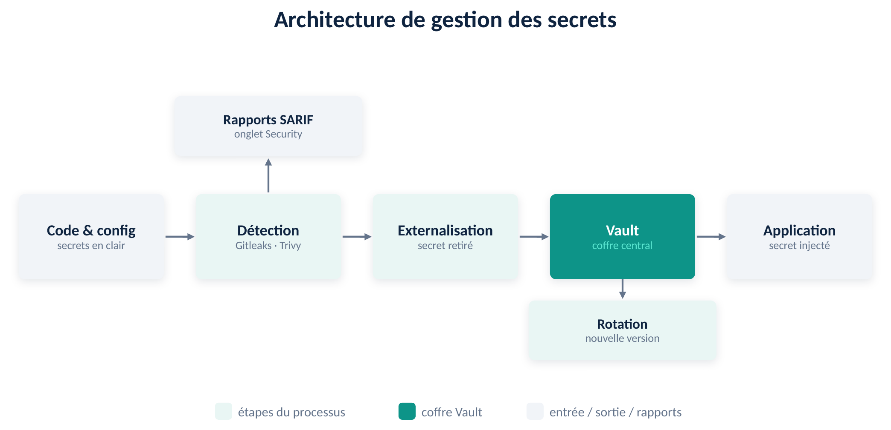

# Gestion des secrets — Architecture et bonnes pratiques

Application cible : **OWASP WrongSecrets**

Ce document répond à l'objectif du projet : *documenter l'architecture de gestion des secrets et les bonnes pratiques appliquées*. Il décrit comment les secrets sont détectés, centralisés, externalisés, injectés et renouvelés dans le cadre d'une chaîne CI/CD DevSecOps.

---

## 1. Architecture de gestion des secrets

### 1.1 Schéma

### 1.2 Cycle de vie d'un secret

L'architecture suit le parcours d'un secret, de son existence dans le code jusqu'à son injection dans l'application déployée :

1. **Code et configuration** — à l'origine, les secrets se trouvent en clair dans le dépôt (code source, fichiers de configuration, image Docker, infrastructure as code).
2. **Détection (CI/CD)** — à chaque commit, le pipeline analyse le code. La détection de secrets agit comme une **barrière** : le pipeline échoue si un secret est trouvé. Les rapports d'analyse sont publiés dans l'onglet **Security** de GitHub et conservés comme artefacts.
3. **Externalisation** — la valeur en clair est retirée du fichier de configuration et remplacée par une **référence** à une variable d'environnement.
4. **Coffre-fort (HashiCorp Vault)** — la valeur réelle est stockée dans Vault, chiffrée au repos, avec versioning (moteur KV v2) et contrôle d'accès par *policy*.
5. **Application déployée** — au démarrage, le secret est lu depuis Vault et **injecté au runtime** via une variable d'environnement ; il ne figure plus jamais dans le dépôt Git.
6. **Rotation** — un mécanisme de rotation renouvelle régulièrement le secret dans Vault, créant une nouvelle version et réduisant la fenêtre d'exposition.

### 1.3 Composants

| Composant | Rôle dans l'architecture |
|-----------|--------------------------|
| **Gitleaks** | Détection de secrets par motifs (regex + entropie) sur les fichiers et l'historique Git. Sert de barrière bloquante en CI. |
| **TruffleHog** | Détection avec **vérification active** (teste si un secret est encore valide). Complète Gitleaks. |
| **Trivy** | Scan de l'**image Docker** (secrets « cuits » dans les couches) et des **mauvaises configurations** de l'infrastructure as code. |
| **GitHub Actions** | Chaîne CI/CD : exécute les scans, le build/test, la release, et publie les rapports SARIF dans l'onglet Security. |
| **HashiCorp Vault** | Coffre-fort centralisé et chiffré (moteur KV v2). Stocke les secrets, gère le contrôle d'accès (*policies*), le versioning et la rotation. |
| **Policy + token Vault** | Accès en **lecture seule** au secret applicatif et token à durée de vie limitée (TTL) — principe du moindre privilège. |
| **Spring `${...}`** | Mécanisme d'externalisation : l'application lit ses secrets depuis des variables d'environnement, alimentées par Vault. |
| **Script de rotation** | Renouvelle le secret (génération aléatoire), écrit une nouvelle version dans Vault, et journalise l'opération. |

### 1.4 Surfaces couvertes et flux des rapports

La détection couvre **trois surfaces** d'exposition : les fichiers du code, l'historique Git, et l'image Docker / l'infrastructure as code. Chaque scan (Gitleaks, Trivy) produit un rapport au format **SARIF**, envoyé dans l'onglet **Security** de GitHub et conservé comme artefact téléchargeable. Les rapports d'analyse sont également stockés dans le dépôt (dossier `reports/`).

---

## 2. Bonnes pratiques appliquées

| Bonne pratique | Mise en œuvre |
|----------------|---------------|
| **Shift-left** (sécurité en amont) | La détection de secrets s'exécute en début de pipeline et **bloque** le build en cas de secret détecté. |
| **Défense en profondeur** | Plusieurs outils complémentaires sont combinés (Gitleaks pour la couverture, TruffleHog pour la vérification, Trivy pour le conteneur et l'IaC). |
| **Couverture de toutes les surfaces** | Analyse du code, de l'historique Git, de l'image Docker et de l'infrastructure as code. |
| **Centralisation des secrets** | Tous les secrets sont regroupés dans un coffre-fort unique et chiffré (Vault) plutôt que dispersés dans le code. |
| **Moindre privilège** | Une *policy* en lecture seule et un token applicatif limité remplacent le token root ; l'application n'a accès qu'à son propre secret. |
| **Secrets à durée de vie limitée** | Le token Vault dispose d'un TTL ; les accès expirent automatiquement. |
| **Externalisation hors du code** | Les secrets sont retirés des fichiers de configuration et injectés au runtime depuis Vault. |
| **Rotation des secrets** | Un script renouvelle les secrets (versioning KV v2) et la rotation peut être planifiée (cron ou GitHub Actions `schedule`). |
| **Aucun secret dans la CI/CD** | La publication de l'image utilise le `GITHUB_TOKEN` intégré ; aucun identifiant n'est stocké en dur dans le pipeline. |
| **Chiffrement au repos** | Vault chiffre les secrets stockés ; encoder en base64 n'est pas considéré comme une protection. |
| **Conservation des rapports** | Les rapports d'analyse sont publiés dans l'onglet Security et conservés (artefacts + dossier `reports/`). |
| **Traçabilité** | Historique de commits clair et conventionnel (`feat`, `fix`, `chore`, `ci`, `docs`) retraçant la démarche. |

---

## 3. Limites et pistes d'amélioration

- **Vault en mode dev** : utilisé ici à des fins d'apprentissage (stockage en mémoire, token root trivial). En production, déployer Vault en mode serveur avec stockage persistant chiffré, *unseal* et révocation du token root.
- **Externalisation native** : utiliser l'intégration **Spring Cloud Vault** pour que l'application lise directement ses secrets dans Vault, sans variables d'environnement intermédiaires.
- **Rotation dynamique** : exploiter les **secrets dynamiques** de Vault (identifiants éphémères générés et révoqués automatiquement).
- **Injection en Kubernetes** : recourir au **Vault Sidecar Injector** ou à l'**External Secrets Operator** pour injecter les secrets dans les pods.
- **Historique Git** : un secret ayant figuré dans l'historique doit être considéré comme compromis et renouvelé ; l'historique peut être purgé (`git filter-repo`) en complément.
